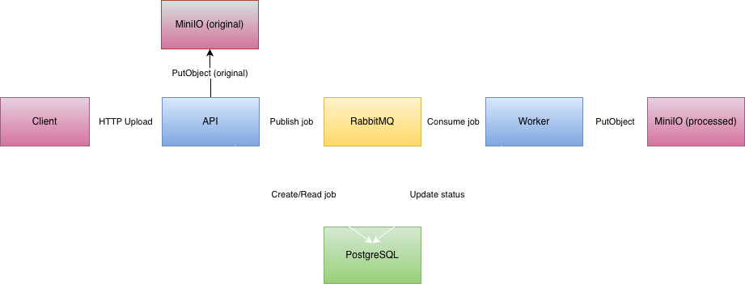
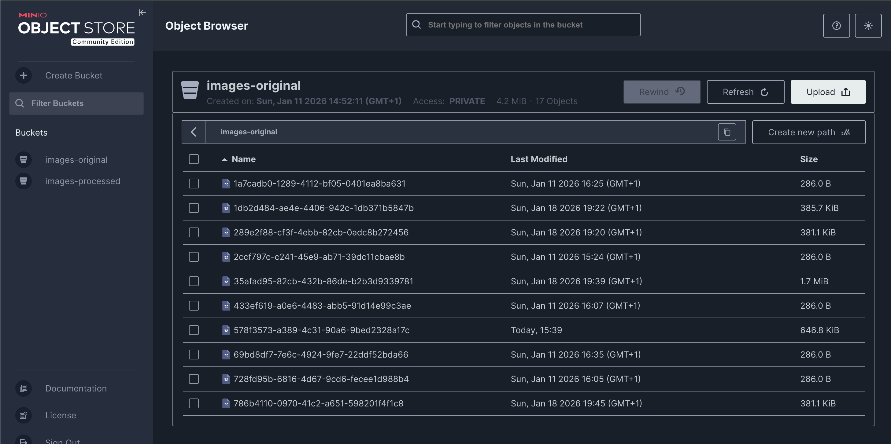
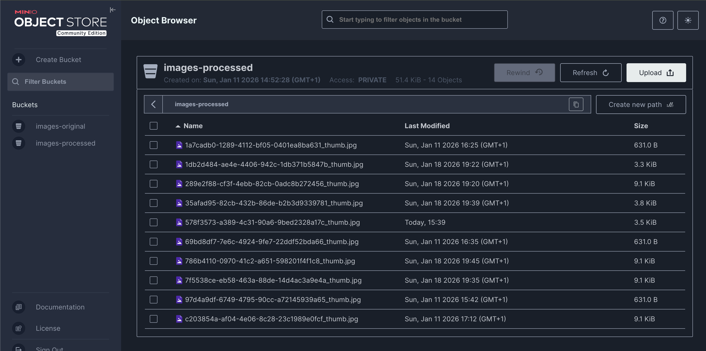
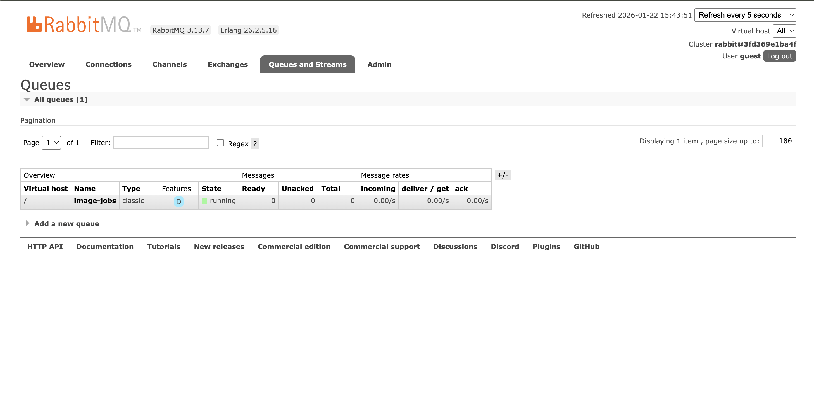
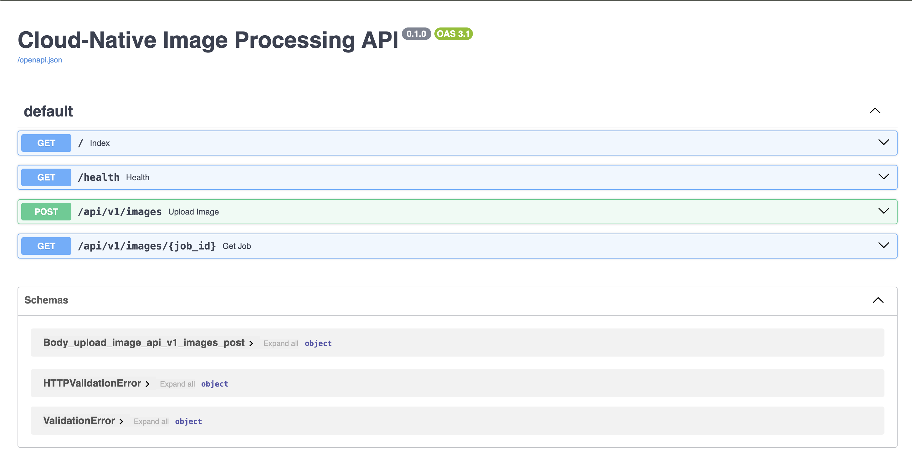
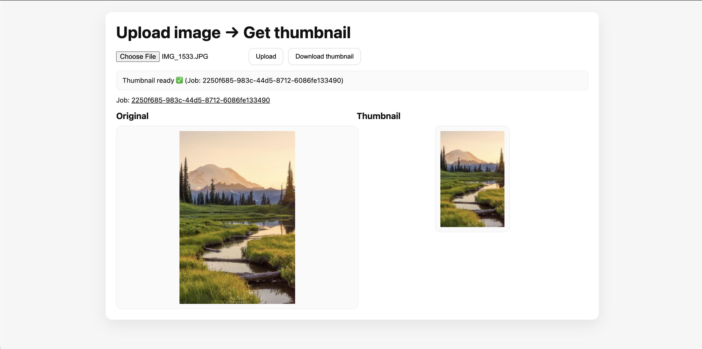

# Cloud-Native Image Processing Pipeline

## Projektübersicht
Dieses Projekt implementiert eine cloud-native, eventgetriebene Bildverarbeitungspipeline
als lauffähigen Minimum Viable Product (MVP).

Benutzer:innen können Bilder über eine REST-API hochladen. Die Bilder werden in einem
S3-kompatiblen Object Storage gespeichert, asynchron verarbeitet und anschließend als
Thumbnail erneut abgelegt. Der Verarbeitungsstatus kann jederzeit über die API abgefragt werden.

Das Projekt demonstriert zentrale Cloud-Native-Konzepte wie lose gekoppelte Services,
asynchrone Verarbeitung, Containerisierung, Dev/Prod-Parity und Infrastructure as Code.

---

## Architektur



### Komponenten
- **Client** – Sendet Upload-Anfragen an die API
- **API-Service (FastAPI)** – Upload, Job-Erstellung, Statusabfrage
- **RabbitMQ** – Asynchrone Message Queue
- **Worker-Service (Python)** – Bildverarbeitung & Thumbnail-Erstellung
- **MinIO (S3-kompatibel)** – Speicherung von Originalen & Thumbnails
- **PostgreSQL** – Persistenz von Job-Status & Metadaten

**Job-Lifecycle:** `PENDING → PROCESSING → DONE`

---

## Technologiestack
- Programmiersprache: Python
- API: FastAPI
- Worker: Python
- Message Queue: RabbitMQ
- Datenbank: PostgreSQL
- Object Storage: MinIO (S3-kompatibel)
- Containerisierung: Docker
- Orchestrierung: Docker Compose
- CI: GitHub Actions

---

## Bildverarbeitungs-Workflow
1. Upload eines Bildes über die REST-API
2. Speicherung des Originals in MinIO
3. Veröffentlichung eines Jobs in RabbitMQ
4. Verarbeitung durch den Worker
5. Speicherung des Thumbnails
6. Aktualisierung des Job-Status

### Originalbilder


### Verarbeitete Bilder (Thumbnails)


### Message Queue


---

## API-Dokumentation

Die REST-API ist mit OpenAPI (Swagger) dokumentiert und wird automatisch von FastAPI generiert.



Swagger UI ist erreichbar unter:
`http://localhost:8000/docs`

---

## Lokale Ausführung

### Voraussetzungen
- Docker
- Docker Compose

### Anwendung starten
```bash
cd deploy
docker compose up --build
```

### Nutzung & Test

**Bild hochladen:**
```bash
curl -F "file=@example.jpg" http://localhost:8000/api/v1/images
```

**Antwort:**
```json
{
  "id": "<JOB_ID>",
  "status": "PENDING"
}
```

**Job-Status abfragen:**
```bash
curl http://localhost:8000/api/v1/images/<JOB_ID>
```

**Antwort:**
```json
{
  "id": "<JOB_ID>",
  "status": "DONE",
  "variants": [
    { "type": "original" },
    { "type": "thumbnail" }
  ]
}
```

## Ergebnisüberprüfung

Die Verarbeitungsergebnisse können über die MinIO Console überprüft werden:

- **URL:** http://localhost:9001
- **Benutzername:** minioadmin
- **Passwort:** minioadmin

**Buckets:**
- `images-original` – Originalbilder
- `images-processed` – Generierte Thumbnails

## Optionale UI-Demonstration

Eine einfache Web-UI ist verfügbar unter `http://localhost:8080` (siehe `frontend/` Verzeichnis).



## Anwendung ausgewählter 12-Factor-Prinzipien

- **Konfiguration über Environment-Variablen** – Alle Services konfigurieren sich über Umgebungsvariablen
- **Explizite Dependency-Definition** – Dependencies sind in `requirements.txt` definiert
- **Logs über stdout** – Services loggen direkt nach stdout/stderr
- **Dev/Prod-Parity durch Containerisierung** – Gleiche Container in Entwicklung und Produktion
- **Neustartbare Services** – Services sind stateless und können jederzeit neu gestartet werden

## CI-Pipeline

Das Projekt enthält eine GitHub-Actions-CI-Pipeline zur automatischen Validierung der Services.

## Fazit

Dieses Projekt demonstriert eine vollständige cloud-native Bildverarbeitungspipeline
mit asynchroner Verarbeitung, klarer Architektur und realistischen Infrastrukturkomponenten.

## Autor

**Name:** Kostandin Kreci

**GitHub:** [kostandinkreci](https://github.com/kostandinkreci)

